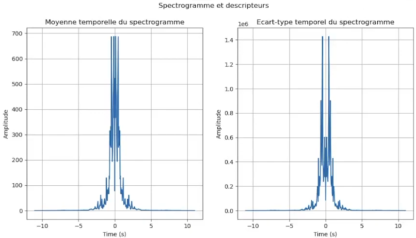
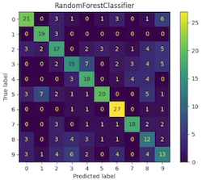
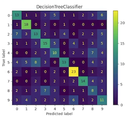
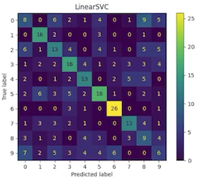

> Tanguy ROUDAUT - Baptiste LE ROUX - Mathis LE ROUX
>
> FIPASE 24

[](https://forthebadge.com) [](https://forthebadge.com) [](https://forthebadge.com)

Au cours des 16h de Cr dédiés à cette matière nous avons conçu un programme permettant la reconnaissance de style musical d’après un extrait audio de 30 secondes.
Nous avons utilisé la base de données GTZAN[1] : 1000 pistes audio de 30 secondes, format .au, avec 10 classes (blues, classique, country, Disco, Hiphop, Jazz, Metal, Pop, Reggae, Rock).


## Sommaire 
1. [Utilisation](#utilisation)
2. [Extraction des descripteurs](#extraction-des-descripteurs)
3. [Entrainement des modèles](#entrainement-des-models)
4. [Prédiction](#prédiction)
5. [Mesure des performances](#mesure-de-performance)

## Utilisation

1. __Compilation__
    - Sur PC de dev: `$ ./run.sh setup_project`
    - Sur Raspberry Pi: `$ ./run.sh setup_project -t`

1. [__Extraction des descripteurs__](#extraction-des-descripteurs)
    - Mode normal: `$ ./run.sh create_dataset`
    - Mode de debug: `$ ./run.sh create_dataset -d`
        <p>
        <a href="https://youtu.be/et4SyZprzkw">
            
        </a>
        </p>

2. [__Entrainement des modèles__](#entrainement-des-models)
    - Sur PC de dev: `$ ./run.sh train_model`


3. [__Prédiction à l'aide des modèles__](#prédiction)
    - En Python sur PC de dev: `$ ./run.sh predict -l python`
        <p>
        <a href="https://youtu.be/fa-HDyBif2s">
            
        </a>
        </p>
    - En C++ sur PC de dev: `$ ./run.sh predict -l cpp`
        <p>
        <a href="https://youtu.be/UQsWJZHy_KQ">
            
        </a>
        </p>
    - En C++ sur cible: `$ ./run.sh predict -l cpp` (Il ne faut pas oublier que le projet doit être compilé pour la cible, option `-t`)
        <p>
        <a href="https://youtu.be/3dIC714V6eE">
            
        </a>
        </p>


_NB: Il est important de conserver la structure de nos dossiers, sinon le code ne fonctionnera pas:_
- _Les fichiers audios: `resources/au_files`_
- _Les fichiers CSV: `resources/csv_files`_
- _Les modèle Python: `resources/model`_
- _Les modèle C++: `cpp/model`_

## Extraction des descripteurs

Il est conseillé de réaliser l'extraction des descripteurs sur le PC de développement pour des raisons de performance. Le code étant écrit en C++ il peut être exécuter sur Raspberry PI sans problème de portabilité, mais le temps d'exécution sera rallongé.

- __Mode Normal:__ \
Ce mode permet d'extraire tous les descripteurs de chaque fichier audio présent dans le dossier `resources/au_files`. Le code `cpp/audio_preprocessing` permet de lire chaque fichier audio, 
de réaliser une FFT et de calculer les descripteurs _mu_ et _sigma_ des fichiers audios. Ces descripteurs sont ensuite enregistrés au format CSV dans un sous dossier portant le nom de l'audio dans le répertoire `resources/csv_files`. Tout au long de l'extraction, les descripteurs de chaque fichier audio sont également ajoutés au fichier `resources/csv_files/dataset.csv`, ce qui permet de garder une trace par fichier audio mais également d'avoir notre dataset pour réaliser nos entrainements et prédictions.
- __Mode Debug:__ \
Ce mode réalise les mêmes étapes que le mode normal mais seulement un fichier audio est traité. Nous avons choisi le fichier audio _blues.00000.au_, mais si vous souhaitez utiliser un autre vous pouvez remplacer son path par un autre dans le fichier `run.sh`. Le dataset sera sauvegardé dans le fichier `resources/csv_files/dataset_debug.csv`. A la suite de l'extraction des descripteurs, ils sont affichés à l'aide `matplotlibcpp.cpp`.

    

## Entrainement des models

L'entrainement des modèles doit être réalisé sur PC de dev, la puissance du Raspberry est trop faible pour cette étape. De plus, le code étant en python il est possible de faire face à des problèmes de portabilité.

Le fichier `resources/csv_files/dataset.csv` créé précédement est ouvert et splité en deux autres dataset, `resources/csv_files/dataset_train.csv` et `resources/csv_files/dataset_test.csv`. Cela nous permet d'avoir une portion de dataset que nos modèles n'ont pas rencontré. \
Notre dataset d'entrainement est ensuite normalisé à l'aide de `StandardScaler`, dont ses poids sont sauvegardés dans `resources/scaler.txt`. Ce fichier sera nécessaire pour normaliser notre dataset au moment de la prédiction pour avoir la même cohérence dans l'ensemble de nos dataset.

Maintenant que nos données d'entrainement sont prêtes, nous pouvons entraîner nos modèles et les convertir dans un format compatible pour nos prédictions en C++:
- __Random Forest:__ `sklearn.ensemble.RandomForestClassifier`, permet de créer notre modèle en lui passant nos descripteurs avec la fonction `RandomForestClassifier.fit()`. Les étapes sont simples pour l'entrainement de notre modèle et il en est de même pour la sauvegarde. On utilise le format `.joblib` pour réaliser nos prédictions en Python et `emlearn` pour convertir notre modèle en `.h`.
- __Decision Tree:__ Les étapes sont similaires pour ce modèle mais, lors de l'entrainement il faut utiliser le classifieur `sklearn.tree.DecisionTreeClassifier`.
- __LinearSVC:__ La méthode d'entrainement est la même grâce au classifieur `sklearn.svm.LinearSVC`.\
Ici, `emlearn` ne nous permet pas de convertir notre modèle. Il faut donc le réaliser manuellement, 2 possibilités s'offrent à nous, la sauvegarde des poids dans un fichier `.txt` ou dans un `.h`. Nous avons décidé de le sauvegarder dans un format `.h`. Plus complexe au moment de la sauvegarde puisqu'il ne faut pas faire d'erreur qui pourrait empêcher la compilation, mais un gain de temps important. Si nous avions sauvegarder nos poids dans un `.txt` il aurait fallut parser le fichier au moment de la prédiction ce qui est une perte de temps.
- __Neural Network:__ L'entraînement du modèle est cette fois-ci plus complexe. Nous utilisons TensorFlow pour créer notre modèle et ajuster ses couches. Après plusieurs tests, nous avons décidé d'utiliser une architecture comprenant plusieurs couches denses. La première couche dense a 128 neurones avec une activation 'relu' et prend en entrée les dimensions de nos données. Elle est suivie par une deuxième couche dense de 64 neurones, également avec une activation 'relu'. Après cela, nous avons une couche 'Flatten' pour aplatir les données avant de les passer à une autre couche dense de 64 neurones. Pour éviter le surajustement, nous avons intégré une couche 'Dropout' avec un taux de 0,5. Enfin, la couche de sortie comporte autant de neurones que de classes dans notre problème, avec une activation 'softmax' pour la classification multiclasse. \
Nous avons finalement sauvegardé notre modèle au format `.tflite`

A la fin de l'entrainement, tous nos modèles se trouvent dans le dossier `resources/model`. Il ne faut pas oublier de déplacer nos modèles C++ dans le dossier `cpp/model`.


## Prédiction

Nous avons mis en place deux types de prédictions, l'une en C++ et l'autre en Python. Celle en python est plus simple à mettre en place grâce à la fonction `predict()`, nous l'avons principalement utilisé pour vérifier le bon fonctionnement de nos modèles. Nous allons donc décrire dans cette partie le fonctionnement de la prédiction en C++.\
Au moment de la prédiction il est important d'utiliser notre dataset `resources/dataset_test.csv`, pour s'assurer que les données prédites sont inconnus par nos modèles. 

- __Normalisation:__ La normalisation est une étape importante pour assurer une cohérence entre nos descripteurs utilisés pour la prédiction et ceux utilisés lors de l'entraînement des modèles. Nous avions utilisé un scaler qui est sauvegardé dans le fichier `resources/scaler.txt`. La méthode est simple : on l'ouvre pour récupérer nos poids, qui sont aussi nombreux que nos descripteurs, et on applique ces coefficients de normalisation à chaque descripteur de notre jeu de données. Cela permet de standardiser les données en fonction des valeurs apprises lors de l'entraînement, assurant ainsi que les valeurs d'entrée du modèle lors de la prédiction soient sur la même échelle que celles utilisées pendant l'entraînement. 
- __Random Forest:__ La prédiction est simple, on utilise la fonction `RandomForestClassifier_predict` fournis par `emlearn` dans notre fichier `.h`, avec en arguments nos descripteurs et leurs nombres. La fonction nous retourne la prédiction de classe dans laquelle se trouve notre fichier audio.
- __Decision Tree:__ La procédure est la même grâce à la fonction `DecisionTreeClassifier_predict`
- __LinearSVC:__ Pour ce modèle, nous utilisons un codage manuel. Chaque descripteur est multiplié par un poids correspondant de notre modèle, situé au même indice, auquel on ajoute ensuite le terme de _biais_. Comme nous avons 10 classes, il est nécessaire de répéter cette étape 10 fois, en utilisant les 10 ensembles différents de vecteurs de poids et de biais. La multiplication de chaque descripteur par son poids associé, suivie de l'addition du biais, génère un score pour chaque classe. La classe avec le score le plus élevé est choisie comme la prédiction de notre modèle.
- __Neural Network:__ Pour ce modèle, nous utilisons TensorFlow Lite pour effectuer des prédictions en temps réel. Le modèle est chargé à partir du fichier `.tflite` créer lors de l'entrainement puis un interpréteur TensorFlow Lite est construit. Une fois l'interpreteur configuré, nous allouons les tenseurs nécessaires. Pour chaque ensemble de caractéristiques, ces dernières sont chargées dans le tenseur d'entrée. L'interpréteur exécute alors le modèle, et les scores de sortie pour chaque classe sont récupérés. Finalement il faut parcourir les scores pour identifier la classe avec le score le plus élevé, qui représente notre prédiction. \
Cette prédiction fonctionne que si le projet est compilé sur Raspberry Pi puisque `tensorflowlite` est nécessaire, si le code C++ est compilé pour une autre cible alors la prédiction avec le neural network sera évité.

## Mesure de performance

__Performance à l'entrainement (Python)__

<table>
    <tr>
        <th></th>
        <th>Random Forest</th>
        <th>Decision Tree</th>
        <th>Lineare SVC</th>
        <th>Neural Network</th>
    </tr>
    <tr>
        <td>Précision</td>
        <td>0.55</td>
        <td>0.42</td>
        <td>0.38</td>
        <td>0.52</td>
    </tr>
    <tr>
        <td>Ratio</td>
        <td>180/330</td>
        <td>138/330</td>
        <td>122/330</td>
        <td></td>
    </tr>
    <tr>
        <td>Temps d'éxecution</td>
        <td>16.26ms</td>
        <td>1.46ms</td>
        <td>2.80ms</td>
        <td>205.24ms</td>
    </tr>
</table>


  

__Performance à la prédiction (Python)__

<table>
    <tr>
        <th></th>
        <th>Random Forest</th>
        <th>Decision Tree</th>
        <th>Lineare SVC</th>
        <th>Neural Network</th>
    </tr>
    <tr>
        <td>Précision</td>
        <td>0.54</td>
        <td>0.41</td>
        <td>0.38</td>
        <td>0.52</td>
    </tr>
    <tr>
        <td>Ratio</td>
        <td>180/330</td>
        <td>138/330</td>
        <td>122/330</td>
        <td>173/330</td>
    </tr>
    <tr>
        <td>Temps d'éxecution</td>
        <td>14.29ms</td>
        <td>0.84ms</td>
        <td>4.15ms</td>
        <td>22.43ms</td>
    </tr>
</table>


__Performance à la prédiction (C++ sur PC de dev)__

<table>
    <tr>
        <th></th>
        <th>Random Forest</th>
        <th>Decision Tree</th>
        <th>Lineare SVC</th>
        <th>Neural Network</th>
    </tr>
    <tr>
        <td>Précision</td>
        <td>0.54</td>
        <td>0.41</td>
        <td>0.36</td>
        <td></td>
    </tr>
    <tr>
        <td>Ratio</td>
        <td>180/330</td>
        <td>138/330</td>
        <td>122/330</td>
        <td></td>
    </tr>
    <tr>
        <td>Temps d'éxecution</td>
        <td>4.38ms</td>
        <td>0.089ms</td>
        <td>41.291ms</td>
        <td></td>
    </tr>
</table>


__Performance à la prédiction (C++ sur raspberry)__

<table>
    <tr>
        <th></th>
        <th>Random Forest</th>
        <th>Decision Tree</th>
        <th>Lineare SVC</th>
        <th>Neural Network</th>
    </tr>
    <tr>
        <td>Précision</td>
        <td>0.54</td>
        <td>0.41</td>
        <td>0.36</td>
        <td>0.52</td>
    </tr>
    <tr>
        <td>Ratio</td>
        <td>180/330</td>
        <td>138/330</td>
        <td>122/330</td>
        <td>173/330</td>
    </tr>
    <tr>
        <td>Temps d'éxecution</td>
        <td>9.149ms</td>
        <td>0.444ms</td>
        <td>127.249ms</td>
        <td>50.723ms</td>
    </tr>
</table>


On constate que notre modèle le plus performant pour la classification est le _Random Forest_, mais on remarque également que la prédiction en C++ à un réel
intérêt puisque les performances sont bien meilleures d'un point de vue de temps d'éxecution mais également de consommation de mémoire. On peut voir ci-dessous que nos modèles 
`.h` sont moins lourds que ceux utilisés en python. 

```bash
$ lsd -l resources/model/
.rw-r--r-- tanguyrdt staff  54 KB Sat Jan 27 11:27:50 2024 DecisionTreeClassifier.joblib
.rw-r--r-- tanguyrdt staff  81 KB Sat Jan 27 11:27:50 2024 LinearSVC.joblib
.rw-r--r-- tanguyrdt staff 4.1 MB Sat Jan 27 11:27:50 2024 RandomForestClassifier.joblib
.rw-r--r-- tanguyrdt staff 1.7 MB Sat Jan 27 11:27:50 2024 Sequential.joblib

$ lsd -l cpp/model/
.rw-r--r-- tanguyrdt staff 178 B  Sat Jan 27 11:27:42 2024 CMakeLists.txt
.rw-r--r-- tanguyrdt staff  44 KB Sat Jan 27 11:27:42 2024 DecisionTreeClassifier.h
.rw-r--r-- tanguyrdt staff 218 KB Sat Jan 27 11:27:42 2024 LinearSVC.h
.rw-r--r-- tanguyrdt staff 566 KB Sat Jan 27 11:27:42 2024 NeuralNetwork.tflite
.rw-r--r-- tanguyrdt staff 3.2 MB Sat Jan 27 11:27:42 2024 RandomForestClassifier.h
```
