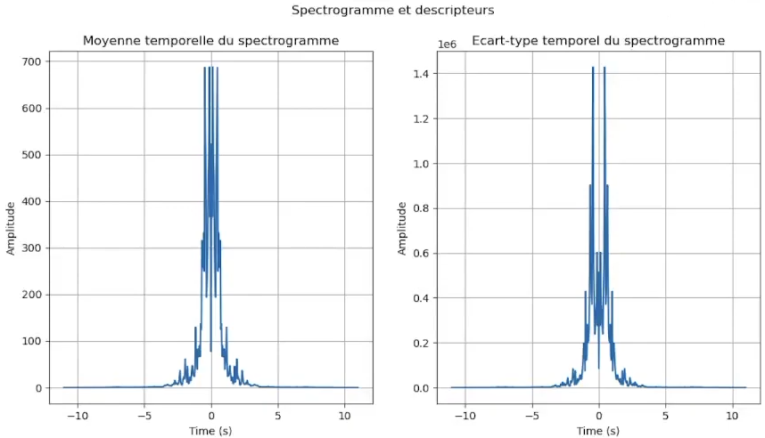
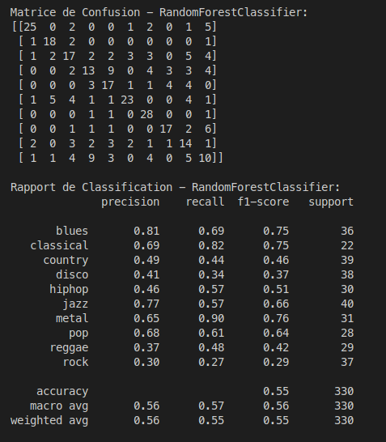

Au cours des 16h de Cr dédiés à cette matière nous avons conçu un programme permettant la reconnaissance de style musical d’après un extrait audio de 30 secondes.
Nous avons utilisé la base de données GTZAN[1] : 1000 pistes audio de 30 secondes, format .au, avec 10 classes (blues, classique, country, Disco, Hiphop, Jazz, Metal, Pop, Reggae, Rock).


## Utilisation

1. __Compilation__
    - Sur PC de dev: `$ ./run.sh setup_project`
    - Sur Raspberry Pi: `$ ./run.sh setup_project -t`

1. [__Extraction des descripteurs__](#extraction-des-descripteurs)
    - Mode normal: `$ ./run.sh create_dataset`
    - Mode de debug: `$ ./run.sh create_dataset -d`
        <p>
        <a href="https://youtu.be/et4SyZprzkw">
            
        </a>
        </p>

2. [__Entrainement des models__](#entrainement-des-models)
    - Sur PC de dev: `$ ./run.sh train_model`


3. [__Prédiction à l'aide des models__](#prédiction-à-laide-des-models)
    - En Python sur PC de dev: `$ ./run.sh predict -l python`
    - En C++ sur PC de dev: `$ ./run.sh predict -l cpp`
    - En C++ sur cible: `$ ./run.sh predict -l cpp` (Il ne faut pas oublier que le projet doit être compilé pour la cible, option `-t`)


_NB: Il est important de conservé la structure de nos dossiers, sinon le code ne fonctionnera pas:_
- _Les fichiers audio: `resources/au_files`_
- _Les fichiers CSV: `resources/csv_files`_
- _Les modèle Python: `resources/model`_
- _Les modèle C++: `cpp/predictor/model`_

## Extraction des descripteurs

Il est conseillé de réaliser l'éxtraction des descripteurs sur le PC de développement pour des raisons de performance. Le code étant écris en C++ il peut être éxecuter sur Raspberry PI sans problème de portabilité, mais le temps d'éxecution sera rallonger.

- __Mode Normal:__ \
Ce mode permet d'extraire tous les déscripteurs de chaque fichier audio présent dans le dossier `resources/au_files`. Le code `cpp/audio_preprocessing` permet de lire chaque fichier audio, 
de réaliser une FFT est de calculer les descripteurs _mu_ et _sigma_ des fichiers audios. C'est déscripteurs sont ensuite enregistrer au format CSV dans un sous dossier portant le nom de l'audio dans le répertoire `resources/csv_files`. Au long de l'éxtractions, les déscripteurs de chaque fichier audio sont également ajouté au fichier `resources/csv_files/dataset.csv`, ce qui permet de garder une trace par fichier audio mais également d'avoir notre dataset pour réaliser nos entrainement et prédictions.
- __Mode Debug:__ \
Ce mode réalise les mêmes étapes que le mode normal mais seulement un fichier audio est traité. Nous avons choisis le fichier audio _blues.00000.au_, mais si vous souhaitez utiliser un autre vous pouvez remplacer sont path par un autre dans le fichier `run.sh`. Le dataset sera sauvegardé dans le fichier `resources/csv_files/dataset_debug.csv`. A la suite de l'éxtraction des déscripteurs, ils sont afficher à l'aide `matplotlibcpp.cpp`.

    

## Entrainement des models

L'entrainement des modèles doit être réalisé sur PC de dev, la puissance du Raspberry est trop faible pour cette étape. De plus, le code étant en python il est possible de faire fasse à des problèmes de portabilité.

Le fichiers `resources/csv_files/dataset.csv` créer précédement est ouvert et spliter en deux autres dataset, `resources/csv_files/dataset_train.csv` et `resources/csv_files/dataset_test.csv`. Ce la nous permet d'avoir une portion de dataset que nos modèles n'ont pas rencontré. \
Notre dataset d'entrainement est ensuite normalisé à l'aide de `StandardScaler`, dont ses poids sont sauvegarder dans `resources/scaler.txt`. Ce fichier sera nécessaire pour normaliser notre dataset au moment de la prédication pour avoir la même cohérence dans l'ensemble de nos dataset. 

Maintenant que nos données d'entrainement sont prête, nous pouvons entrainer nos modèle et les convertir dans un format compatible pour nos prédiction en C++:
- __Random Forest:__ `sklearn.ensemble.RandomForestClassifier`, permet de créer notre modèle en lui passant nos déscripteurs avec la fonction `RandomForestClassifier.fit()`. Les étapes sont simple pour l'entrainement de notre modèle et il en est de même pour la sauvegarde. On utilise le format `.joblib` pour réaliser nos prédiction en Python et `emlearn` pour convertir notre modèle en `.h`.
- __Decision Tree:__ Les étapes sont similaire pour ce modèle mais, lors de l'entrainement il faut utiliser le classificateur `sklearn.tree.DecisionTreeClassifier`.
- __LinearSVC:__ La méthode d'entrainement est la même grâce au classifieur `sklearn.svm.LinearSVC`.\
Ici, `emlearn` ne nous permet pas de convertir notre modèle. Il faut donc le réaliser manuellement, 2 possibilité s'offre à nous, la sauvegarde des poids dans un fichier `.txt` ou dans un `.h`. Nous avons décider de le sauvegarder dans un format `.h`. Plus complexe au moment de la sauvegarde puisqu'il ne faut pas faire d'erreur qui pourrait empêcher la compilation, mais un gain de temps important. Si nous avions sauvegarder nos poids dans un `.txt` il aurait fallut parser le fichier au moment de la prédiction ce qui est une perte de temps.
- __Neural Network:__ L'entraînement du modèle est cette fois-ci plus complexe. Nous utilisons TensorFlow pour créer notre modèle et ajuster ses couches. Après plusieurs tests, nous avons décidé d'utiliser une architecture comprenant plusieurs couches denses. La première couche dense a 128 neurones avec une activation 'relu' et prend en entrée les dimensions de nos données. Elle est suivie par une deuxième couche dense de 64 neurones, également avec une activation 'relu'. Après cela, nous avons une couche 'Flatten' pour aplatir les données avant de les passer à une autre couche dense de 64 neurones. Pour éviter le surajustement, nous avons intégré une couche 'Dropout' avec un taux de 0,5. Enfin, la couche de sortie comporte autant de neurones que de classes dans notre problème, avec une activation 'softmax' pour la classification multiclasse. \
Nous avons finalement sauvegarder notre modèle au format `.tflite`

A la fin de l'entrainement, tous nos modèles se trouve dans le dossier `resources/model`. Il ne faut pas oublier de déplacer nos modèle C++ dans le dossier `cpp/predictor/model`.


## Prédiction à l'aide des models

## Mesure de performance

Pour utiliser correctement le projet, il faut executer les codes en suivant rigoureusement les étapes ci-dessous :

### Extraction des descriptors
#### Mode normal

Pour une utilisation normale du code, executez ces lignes de commande qui permettent d'extraire les descripteurs de tous les fichiers audio dans resoources/au_files, les csv se trouvent dans resources/csv_files.

```
$ ./run.sh setup_project 
$ ./run.sh create_dataset
```

#### Mode Debug
<p>
  <a href="https://youtu.be/et4SyZprzkw">
    
  </a>
</p>
Ce mode à utiliser en debug permet d'extraire les descripteurs pour un seul fichier audio et de les afficher graphiquement.

```
$ ./run.sh setup_project -d
$ ./run.sh create_dataset -d
```

### Entrainement des modèles

Executez ces lignes pour entrainer tous les modèles et réaliser une évaluation à la suite.

```
$ ./run.sh setup_project 
$ ./run.sh train_model
```
### Prédiction du modèle

Après avoir entrainé les modèles on réalise la prédiction avec les lignes suivantes:

#### Sur pc en python
<p>
  <a href="https://youtu.be/fa-HDyBif2s">
    
  </a>
</p>

```
$ ./run.sh setup_project 
$ ./run.sh predict -l python
```

#### Sur pc en cpp 
<p>
  <a href="https://youtu.be/UQsWJZHy_KQ">
    
  </a>
</p>

```
$ ./run.sh setup_project 
$ ./run.sh predict -l cpp
```

#### Sur rpi en cpp 
<p>
  <a href="https://youtu.be/3dIC714V6eE">
    
  </a>
</p>

```
$ ./run.sh setup_project -t target
$ ./run.sh predict -l cpp
```
## Performances du système


En testant chacun des modèles nous observons que le plus performant est le Random Forest avec une précision de 55% qui est un résultat attendu. Pour améliorer encore cette précision nous pourrions à l'avenir jouer sur les hyperparamètres pour affiner la prédiction.

## Contributing

Si vous souhaitez contribuer, lisez le fichier [CONTRIBUTING.md](https://example.org) pour savoir comment le faire.

## Auteurs
* **Tanguy Roudaut** _alias_ [@tanguy-rdt](https://github.com/tanguy-rdt)
* **Baptiste Le Roux** _alias_ [@BaptisteLeRouxx](https://github.com/tanguy-rdt)
* **Mathis Le Roux** _alias_ [@Math-lrx](https://github.com/tanguy-rdt)

Lisez la liste des [contributeurs](https://github.com/your/project/contributors) pour voir qui à aidé au projet !
